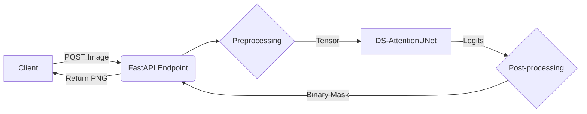

# 🩺 Skin Lesion Segmentation using DS-AttentionUNet

[](https://rvn5801-ds-attentionunet.hf.space/docs)
[](https://www.python.org/downloads/release/python-3100/)
[](https://pytorch.org/)
[](https://www.docker.com/)
[](https://opensource.org/licenses/MIT)

An end-to-end deep learning pipeline for automated skin lesion segmentation, deployed as a containerized microservice on Hugging Face Spaces. This project leverages a custom **DS-AttentionUNet** architecture to assist in the computer-aided diagnosis (CAD) of melanoma by accurately isolating lesions from dermoscopic images.

---

## 🚀 Project Overview

### Problem Statement
Melanoma is the deadliest form of skin cancer, but early detection significantly improves survival rates. Automated segmentation of skin lesions is a critical first step in CAD systems, but presents several challenges:
- **Artifacts**: Hair, gel bubbles, rulers, and surgical markers.
- **Low Contrast**: Fuzzy boundaries between lesions and healthy skin.
- **Variability**: Different skin tones and lesion shapes.

### Solution
This project implements a state-of-the-art deep learning solution that:
1.  **Preprocesses** dermoscopic images to remove artifacts and standardize inputs.
2.  **Segments** lesions using a novel DS-AttentionUNet architecture combining **Attention Gates** (to focus on features) and **Deep Supervision** (for gradient flow).
3.  **Deploys** the model as a RESTful API, allowing users to upload an image and **download** the predicted mask instantly.

---

## 🛠️ Tech Stack

* **Deep Learning:** PyTorch, Albumentations (Augmentation)
* **Architecture:** Custom DS-AttentionUNet (Attention U-Net with Deep Supervision)
* **MLOps:** MLflow (Experiment Tracking)
* **Backend:** FastAPI, Uvicorn
* **Deployment:** Docker, Hugging Face Spaces
* **Data Processing:** OpenCV, NumPy, Pandas

---

## ✨ Key Features

- **State-of-the-art Architecture**: Custom DS-AttentionUNet achieving **0.8356 Dice Coefficient**.
- **Robust Preprocessing**: Handles artifacts and normalizes inputs automatically.
- **Production-Ready**: Containerized with Docker and deployed on Hugging Face Spaces.
- **Interactive API**: Built-in Swagger UI allows for drag-and-drop testing and result downloading.
- **Quality Assurance**: Automated detection of "poisoned" (inverted) training masks during the data pipeline.

---

## 📊 Dataset

**Source**: [ISIC 2018: Task 1 - Lesion Boundary Segmentation](https://challenge.isic-archive.com/data/)

During Exploratory Data Analysis (EDA), we identified critical data quality issues:
* **Class Imbalance:** Lesion regions occupy only 10-40% of the image area.
* **Inverted Masks:** ~2% of ground truth masks were inverted (0=Lesion, 1=Background). These were identified via statistical analysis and quarantined to prevent training corruption.
* **Artifacts:** High prevalence of rulers and hair, addressed via `CoarseDropout` augmentation.

---

## 🧠 Modeling Strategy

**Algorithm: DS-AttentionUNet**
Standard U-Nets often struggle with complex boundaries. This custom architecture improves performance via:
* **Attention Gates:** Learns to weigh input features, suppressing irrelevant background noise (hair, skin texture) while highlighting lesion structures.
* **Deep Supervision:** Computes loss at multiple scales in the decoder, providing direct gradient feedback to earlier layers and refining coarse features.

**Training Details:**
* **Optimizer:** AdamW (`lr=1e-4`, `weight_decay=1e-5`)
* **Loss Function:** `0.5 * DiceLoss + 0.5 * FocalLoss` (Balances structural overlap and hard example mining).
* **Scheduler:** `ReduceLROnPlateau` (Patience=5).

---

## 🏗️ System Architecture & Workflow

The project is designed as a standalone microservice.



---

## 💻 Installation

### Option A: Using Docker (Recommended)
This ensures the exact environment matches production.

```bash
# 1. Clone the repository
git clone https://huggingface.co/spaces/rvn5801/DS-AttentionUNet
cd DS-AttentionUNet

# 2. Build the Docker image
docker build -t rvn5801/ds_attention .

# 3. Run the container
docker run -p 7860:7860 rvn5801/ds_attention
```

---
## 🎯 Usage

### API Endpoints

#### 1. Health Check
```http
GET /
```

**Response:**
```json
{
  "status": "healthy",
  "model": "DS-AttentionUNet",
  "version": "1.0.0"
}
```

#### 2. Segment Lesion
```http
POST /segment
```

**Parameters:**
- `file`: Image file (JPEG/PNG, multipart/form-data)

**Response:**
- Binary segmentation mask (PNG format)

### Example Request

#### Using cURL
```bash
curl -X POST "http://localhost:7860/segment" \
  -H "accept: image/png" \
  -H "Content-Type: multipart/form-data" \
  -F "file=@path/to/lesion_image.jpg" \
  --output segmentation_mask.png
```
---
📈 Model Evaluation & Predictions

The model's inference results and qualitative predictions are documented in an interactive HTML report.

👉 **[View Test Report](reports/test_report.html)**

This report includes:
- Input dermoscopic images
- Predicted lesion masks
- Ground-truth comparisons
- Dice / IoU scores per sample

### Citing This Work

If you use this project in your research, please cite:

```bibtex
@software{ds_attentionunet,
  author = {[Venkata Narayana Redrouthu]},
  title = {DS-AttentionUNet: Deep Supervised Attention U-Net for Skin Lesion Segmentation},
  year = {2025},
  url = {https://huggingface.co/spaces/rvn5801/DS-AttentionUNet}
}
```

---

## 📧 Contact

**Project Maintainer**: Venkata Narayana Redrouthu

- **Email**: redrouthu2025@gmail.com

### Support

- **Issues**: [GitHub Issues](https://github.com/rvn5801/Skin-Lesion-Segmentation-with-Deep-Supervision-and-Attention-Mechanisms/issues)
- **Discussions**: [GitHub Discussions](https://github.com/rvn5801/Skin-Lesion-Segmentation-with-Deep-Supervision-and-Attention-Mechanisms/discussions)
- **Live Demo**: [Hugging Face Space](https://rvn5801-ds-attentionunet.hf.space/docs)

---

## 🌟 Star History

If you find this project helpful, please consider giving it a ⭐ on GitHub!

[](https://star-history.com/rvn5801/Skin-Lesion-Segmentation-with-Deep-Supervision-and-Attention-Mechanisms&Date)

---

<div align="center">

**Made with ❤️ for advancing medical AI**

[Live Demo](https://rvn5801-ds-attentionunet.hf.space/docs)  • [Docker_image](https://hub.docker.com/r/rvn5801/ds_attention)  • [Report Bug](https://github.com/rvn5801/Skin-Lesion-Segmentation-with-Deep-Supervision-and-Attention-Mechanisms/issues)
</div>
